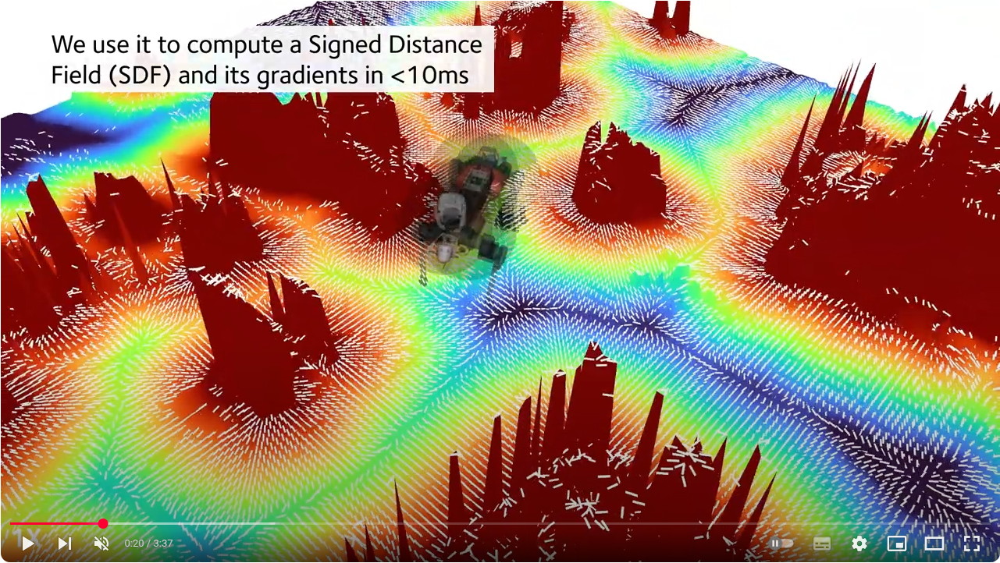

# Field Local Planner

This package implements SE(2) local planners (i.e, planar motion) for environment-aware navigation. It includes the reactive RMP-based local planner from [Mattamala et al (RA-L, 2022)](https://ieeexplore.ieee.org/abstract/document/9682571/).

[](https://youtu.be/G_AwNec5AwU?si=sPCNZVwDZJ09qvvU)


The implementation follows a similar approach to the [ROS1 navigation stack](https://github.com/ros-planning/navigation), implementing different algorithms as plugins.

**This package only supports ROS1**

## Disclaimer
This is research code, and shared as it is (see [LICENSE](LICENSE)). Please be careful when running it in closed-loop with your robot system.

## Repository structure
- [`field_local_planner`](field_local_planner/) is a meta package to build everything.
- [`field_local_planner_base`](field_local_planner_base/) is a ROS-independent package that implements the basic functionalities common to all the local planners. Any derived local planner must inherit from this package.
- [`field_local_planner_msgs`](field_local_planner_msgs/) implements the core ROS messages and actions.
- [`field_local_planner_ros`](field_local_planner_ros/) implements the ROS base plugin from which the other plugins inherit. It implements all the ROS interfaces that provide the data to the local planner.
- [`field_local_planners`](field_local_planners/) stores all the specific implementations of local planners:
  - [`field_local_planner_apf`](field_local_planners/field_local_planner_apf/) implements an Artificial Potential Field local planner based on the RMP implementation (see below).
  - [`field_local_planner_falco`](field_local_planners/field_local_planner_falco/) implements a local planner based on the [CMU SubT team's](https://github.com/HongbiaoZ/autonomous_exploration_development_environment/tree/noetic/src/local_planner) implementation of Zhang, Gu, Gupta & Singh, JFR 2020, [_Falco: Fast likelihood-based collision avoidance with extension to human-guided navigation_](https://onlinelibrary.wiley.com/doi/abs/10.1002/rob.21952)
  - [`field_local_planner_rmp`](field_local_planners/field_local_planner_rmp/) implements a [Riemannian Motion Policies](https://arxiv.org/abs/1801.02854)-based local planner, as described in Mattamala, Chebrolu & Fallon, RA-L 2022, [An Efficient Locally Reactive Controller for Safe Navigation in Visual Teach and Repeat Missions](https://ieeexplore.ieee.org/document/9682571).
  - [`field_local_planner_trackline`](field_local_planners/field_local_planner_trackline/) **is not a local planner**. It implements a pure pursuit controller that tracks a line between the starting position of the robot and the goal, not considering any information of the environment.

## Dependencies
- [`grid_map_filters_drs`](https://github.com/ori-drs/grid_map_filters_drs): required by `field_local_planner_rmp` to generate the grid map fields.
- [`teleop_twist_joy`](https://wiki.ros.org/teleop_twist_joy): `sudo apt install ros-noetic-teleop-twist-joy`. Required if you want to use the controller using twists as input.

## Running the planner
The `field_local_planners_ros` package has all the interfaces to launch the nodes. Each `field_local_planner_<planner>_plugin` package has the parameters required for each planner.

For example, to launch the RMP local planner:
```sh
roslaunch field_local_planner_ros <planner>.launch
```

## Writing new planners
Each new local planner must keep the following folder structure:

```sh
field_local_planner
├── field_local_planner_ros
│   ├── launch
│   │   ├── <your_planner>.launch # Launchfile for your local planner
├── field_local_planners
│   ├── ...
│   ├── field_local_planner_<your_planner>
│   │   ├── field_local_planner_<your_planner> # package implementing the local planner with the computeTwist() and computePath() methods
│   │   │   ├── config         # any ROS-independent parameters/files used by the planner
│   │   │   ├── include        # source code
│   │   │   ├── src            # source code
│   │   │   ├── CMakeLists.txt
│   │   │   └── package.xml
│   │   ├── field_local_planner_<your_planner>_plugin # ROS plugin interface that loads parameters from parameter server/dynamic reconfigure and publishes extra visualizations
│   │   │   ├── config              # ROS parameters (loaded to the parameter server)
│   │   │   ├── dynamic_reconfigure # Dynamic parameters
│   │   │   ├── include
│   │   │   ├── src
│   │   │   ├── CMakeLists.txt
│   │   │   ├── field_local_planner_plugin.xml # the XML to configure the plugin
│   │   │   └── package.xml
```

As a reference, please check:
- For the launchfiles: 
  - [`trackline.launch`](field_local_planner_ros/launch/trackline.launch) for an easy example
  - [`rmp.launch`](field_local_planner_ros/launch/rmp.launch) for an example using grid map with extra filters
- For the packages:
  - [`field_local_planner_trackline`](field_local_planners/field_local_planner_trackline/field_local_planner_trackline) for an example of a simple planner that implements the `Twist computeTwist()` and `Path computePath()` methods required by any local planner.
  - [`field_local_planner_trackline_plugin`](field_local_planners/field_local_planner_trackline/field_local_planner_trackline_plugin) for an example of ROS plugin that loads parameters from the parameter server and dynamic reconfigure.


## Citing
If you use this repository in academic work, please cite:

> M. Mattamala, N. Chebrolu and M. Fallon, "An Efficient Locally Reactive Controller for Safe Navigation in Visual Teach and Repeat Missions," IEEE Robotics and Automation Letters, vol. 7, no. 2, pp. 2353-2360, April 2022, doi: 10.1109/LRA.2022.3143196.


```bibtex
@ARTICLE{Mattamala2022,
  author={Mattamala, Matias and Chebrolu, Nived and Fallon, Maurice},
  journal={IEEE Robotics and Automation Letters}, 
  title={An Efficient Locally Reactive Controller for Safe Navigation in Visual Teach and Repeat Missions}, 
  year={2022},
  volume={7},
  number={2},
  pages={2353-2360},
  doi={10.1109/LRA.2022.3143196}}
```

If additionally you also use the FALCO local planner, please cite:
> Zhang, J, Hu, C, Chadha, RG, Singh, S. Falco: Fast likelihood-based collision avoidance with extension to human-guided navigation. J Field Robotics. 2020; 37: 1300– 1313.

```bibtex
@article{Zhang2020,
author = {Zhang, Ji and Hu, Chen and Chadha, Rushat Gupta and Singh, Sanjiv},
title = {Falco: Fast likelihood-based collision avoidance with extension to human-guided navigation},
journal = {Journal of Field Robotics},
volume = {37},
number = {8},
pages = {1300-1313},
doi = {https://doi.org/10.1002/rob.21952},
year = {2020}
}
```

The implementation of FALCO was adapted from [ground_based_autonomy_basic](https://github.com/jizhang-cmu/ground_based_autonomy_basic/tree/noetic/src/local_planner)
